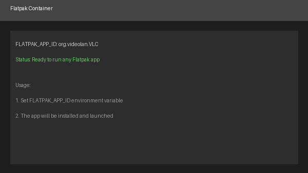

# Flatpak



A generic container that allows you to run any Flatpak application from Flathub or a custom repository.
Simply provide the Flatpak app ID and the container will install and run it.

## Configuration

### Required Environment Variables

- `FLATPAK_APP_ID`: The Flatpak application ID to install and run (e.g., `org.videolan.VLC`, `com.spotify.Client`)

### Optional Environment Variables

- `FLATPAK_REPO_URL`: URL to a Flatpak repository `.flatpakrepo` file (default: `https://flathub.org/repo/flathub.flatpakrepo`)
- `FLATPAK_REPO_NAME`: Name for the custom repository (defaults to "custom")
- `FLATPAK_STARTUP_FLAGS`: Additional flags to pass to the `flatpak run` command

## Usage Examples

### Running VLC Media Player

```toml
[[apps]]
title = "VLC"
start_virtual_compositor = true

[apps.runner]
type = "docker"
name = "WolfVLC"
image = "ghcr.io/games-on-whales/flatpak:edge"
env = [
    "RUN_SWAY=true",
    "GOW_REQUIRED_DEVICES=/dev/input/* /dev/dri/* /dev/nvidia*",
    "FLATPAK_APP_ID=org.videolan.VLC"
]
devices = []
mounts = []
ports = []
base_create_json = """
{
  "HostConfig": {
    "IpcMode": "host",
    "Privileged": false,
    "CapAdd": ["NET_RAW", "MKNOD", "NET_ADMIN"],
    "DeviceCgroupRules": ["c 13:* rmw", "c 244:* rmw"]
  }
}
\
"""
```

### Running Spotify

```toml
[[apps]]
title = "Spotify"
start_virtual_compositor = true

[apps.runner]
type = "docker"
name = "WolfSpotify"
image = "ghcr.io/games-on-whales/flatpak:edge"
env = [
    "RUN_SWAY=true",
    "GOW_REQUIRED_DEVICES=/dev/input/* /dev/dri/* /dev/nvidia*",
    "FLATPAK_APP_ID=com.spotify.Client"
]
devices = []
mounts = []
ports = []
base_create_json = """
{
  "HostConfig": {
    "IpcMode": "host",
    "Privileged": false,
    "CapAdd": ["NET_RAW", "MKNOD", "NET_ADMIN"],
    "DeviceCgroupRules": ["c 13:* rmw", "c 244:* rmw"]
  }
}
\
"""
```

### Using a Custom Repository

```toml
[[apps]]
title = "RSI Launcher"
start_virtual_compositor = true

[apps.runner]
type = "docker"
name = "WolfRSILauncher"
image = "ghcr.io/games-on-whales/flatpak:edge"
env = [
    "RUN_SWAY=true",
    "GOW_REQUIRED_DEVICES=/dev/input/* /dev/dri/* /dev/nvidia*",
    "FLATPAK_APP_ID=com.robertsspaceindustries.RSILauncher",
    "FLATPAK_REPO_URL=https://mactan-sc.github.io/rsilauncher/RSILauncher.flatpakrepo",
    "FLATPAK_REPO_NAME=rsilauncher"
]
devices = []
mounts = []
ports = []
base_create_json = """
{
  "HostConfig": {
    "IpcMode": "host",
    "Privileged": false,
    "CapAdd": ["NET_RAW", "MKNOD", "NET_ADMIN"],
    "DeviceCgroupRules": ["c 13:* rmw", "c 244:* rmw"]
  }
}
\
"""
```

## Finding Flatpak App IDs

You can find the application ID for any Flatpak app on [Flathub](https://flathub.org/).
The app ID is typically displayed on the app's page and follows the reverse domain notation (e.g., `org.mozilla.firefox`).

On a system with Flatpak installed, you can also search for available apps using:
```bash
flatpak search <app-name>
```

Some popular Flatpak app IDs:
- `org.videolan.VLC` - VLC Media Player
- `com.spotify.Client` - Spotify
- `org.mozilla.firefox` - Firefox
- `com.discordapp.Discord` - Discord
- `com.valvesoftware.Steam` - Steam
- `org.gimp.GIMP` - GIMP
